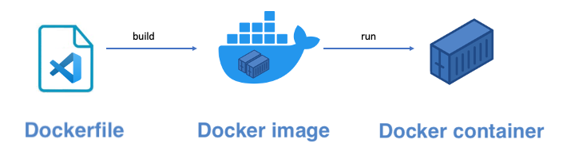
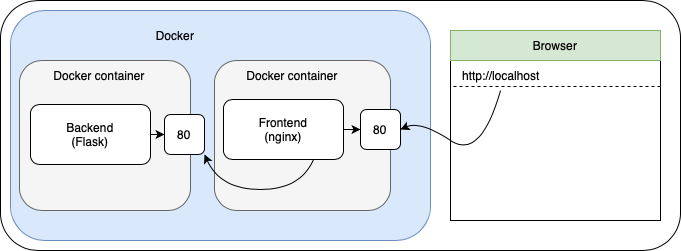

# Docker
На цьому тижні ви познайомитеся з поняттям «контейнери». Ви дізнаєтесь, що таке контейнери, як їх можна використовувати і, нарешті, як створювати контейнери для власних додатків. Завдання структуровані таким чином, що ви будете проходити шлях від знайомства до фінальної реалізації, де потреба «експериментувати» з часом зростатиме. Тому ми **наполегливо** рекомендуємо вам слідувати нашим крокам і підтверджувати, що ви розумієте кожен крок, перш ніж продовжувати.

## Ресурси
**Video:** [Learn Docker in 7 Easy Steps - Full Beginner's Tutorial](https://www.youtube.com/watch?v=gAkwW2tuIqE)
Короткий огляд Docker. Це відео містить короткий огляд Docker та його роботи. У цьому завданні ми обговоримо різні теми, тому не хвилюйтеся, якщо у відео все відбувається дуже швидко.

## Завдання
### Встановлення Docker
**Інструкція:** [Install Docker Desktop with WSL2 backend (Windows/Wsl)](https://docs.docker.com/desktop/windows/wsl/)  
Дотримуйтесь цього посібника, якщо ви використовуєте комп'ютер з Windows. Якщо у вас вже встановлено Docker Desktop: *переконайтеся, що ви оновили його до останньої версії!*.

**Інструкція:** [Install Docker Desktop on Mac](https://docs.docker.com/desktop/install/mac-install/)
Якщо ви користуєтеся комп'ютером Mac, дотримуйтесь цієї інструкції.

### Перевірка установки Docker (і можливі виправлення)
Щоб перевірити правильність встановлення докера, виконайте наступну команду:

```sh
$ sudo docker version
```

Перше, що ви помітите, це помилку, яка вказує на те, що *Не вдається з'єднатися з демоном Docker*: Це тому, що движок Docker ще не запущено.
Має бути деяка інформація про *клієнт*. Ви будете використовувати цей клієнт для того, щоб вказувати движку *що робити*. Сам движок є фоновим процесом.

Запустіть Docker Engine на виконання.
```sh
$ sudo systemctl start docker.service
```
Зауважте, що запуск служби докерів не означає, що вона автоматично запуститься після перезавантаження. Якщо ви хочете, щоб служба докерів автоматично запускалася після перезавантаження, вам слід «enable» її наступним чином:

```sh
$ sudo systemctl enable docker.service
```

Для того, щоб працювати зі службою докерів, вам знадобиться дозвіл на це. Додайте себе до групи `docker` за допомогою цієї команди:

```sh
$ sudo usermod -aG docker $USER
```

Зауважте, що на цьому етапі вам слід перезапустити консоль, оскільки зміни у групі не одразу відображаються у запущеній оболонці. (Також ви можете перезавантажити систему).

Тепер переконайтеся, що движок запустився, повторивши першу команду (`docker version`) перед тим, як виконати перевірку, наведену нижче.

### Hello Docker!
Щоб перевірити правильність роботи вашого середовища виконання Docker, запустіть образ докера «hello-world» і перегляньте його вивід. Образ докера містить файли, необхідні для запуску певної програми. Запуск образу докера у контейнері докера призведе до запуску програми, що зберігається у цьому образі. 
        
Щоб запустити новий контейнер із зображенням «hello-world», виконайте команду run:
```
$ docker run hello-world
```

Як бачите, потрібне зображення буде завантажено автоматично і запущено контейнер. На виході повинно вийти щось на кшталт
```
Hello from Docker!
This message shows that your installation appears to be working correctly.
...
```

Якщо ви бачите наведений вище вивід, це означає, що докер правильно встановлено на вашому ноутбуці. Якщо ні, зверніться за допомогою до викладача.

## Завдання
### 0. Базовий рівень
**Інструкція:** [How to Create Dockerfile step by step and Build Docker Images using Dockerfile](https://automateinfra.com/2022/01/11/how-to-create-a-new-docker-image-using-dockerfile-dockerfile-example/)
Пояснює, як створювати власні образи Docker за допомогою Docker-файлу

На цьому етапі у вас має бути встановлений докер і запущений ваш перший контейнер («Hello World»). Перш ніж ми зануримося у Docker глибше, ми хочемо подивитися, як працює цей контейнер «Hello World». Якщо ви ще не дивилися відео [Learn Docker in 7 Easy Steps - Full Beginner's Tutorial](https://www.youtube.com/watch?v=gAkwW2tuIqE), зробіть це зараз.

Контейнери запускають **Докерні образи**. Для нашого контейнера «Hello World» ми використали вже створений образ. Цей образ можна знайти на сторінці [Docker Hub](https://hub.docker.com/_/hello-world/).

Звідки береться зображення? Цей образ було створено за допомогою `Dockerfile`, а потім завантажено на Docker Hub для всіх бажаючих. Процес переходу від Dockerfile до працюючого контейнера показано нижче. 



Метою цього завдання є створення та запуск нашого власного контейнера «Hello World». У теці `0-primer` ви знайдете файл `Dockerfile` та файл `analysis.txt`. Подивіться на Dockerfile і спробуйте зрозуміти, що все це означає. Потім відкрийте файл `analysis.txt` і дотримуйтесь інструкцій.

### 1. Ваш перший контейнер
Давайте створимо Docker-образ, який зможе запустити статичний веб-сайт. У папці шаблону Ви знайдете папку з назвою `1-container`. Вона містить простий статичний веб-сайт, який Ви можете запустити за допомогою наданого скрипта (`start.sh`). Скрипт також записує запити до файлу з назвою `log.txt`. Запустіть скрипт, відвідайте сайт (на порту 9000) і переконайтеся, що файл журналу створено і він містить запити.
                
Ваше завдання полягає в тому, щоб дописати докерфайл так, щоб:
1. контейнер повинен мати `/app` як робочий каталог
2. скопіюйте необхідні файли до робочого каталогу
3. І останнє, але не менш важливе: вам слід запустити скрипт `start.sh` за допомогою команди [CMD](https://docs.docker.com/engine/reference/builder/#cmd) для обслуговування веб-сайту.

Створіть образ і запустіть контейнер, використовуючи прапорець `-p` докера, щоб відкрити порт 9000 контейнера для порту 9000 хоста. Переконайтеся, що статичний веб-сайт обслуговується, відкривши http://localhost:9000 у вашому браузері.

### 2. Скрипт для керування контейнерами
**Документація:** [Docker detached mode](https://www.freecodecamp.org/news/docker-detached-mode-explained/)
Опція --detach або -d означає, що Docker-контейнер працює у фоновому режимі вашого терміналу. 

Коли Ви запускаєте контейнер з терміналу, інформація з контейнера відображається в терміналі. Це відбувається тому, що контейнер працює на передньому плані. Запустивши контейнер в автономному режимі, Ви зможете перемістити його на задній план. 

У теці шаблону Ви знайдете скрипт `todo.sh`. Відредагуйте скрипт так, щоб при запуску `./todo.sh 1` він збирав і запускав контейнер у відокремленому режимі і з власним ім'ям.  

### 3. Діагностика контейнера
**Інструкція:** [Getting Into a Docker Container’s Shell](https://www.baeldung.com/ops/docker-container-shell)
Маленька інструкція, яка пояснює, як запустити інтерактивну оболонку в контейнері.

Іноді ваш контейнер поводиться не так, як повинен. У таких випадках корисно «підключитися» до вашого контейнера (запустивши термінал) і подивитися, що відбувається всередині. Зверніть увагу, що контейнер є базовим середовищем linux. Тому можна використовувати більшість команд linux. 

Наразі ваш контейнер реєструє запити до статичного сайту. Ваше завдання полягає в тому, щоб:
1. Покладіть оболонку в контейнер (запустіть його, якщо він ще не запущений).
2. Знайдіть файл `log.txt` у контейнері.
3. Скопіюйте його вміст (за допомогою команди linux `cat` та копіювання/вставки) до файлу `1-container/container.log` у вашій папці шаблонів.

*Підказка:* За допомогою `docker ps` Ви можете переглянути запущені контейнери. 

### 4. Запуск існуючих зображень
**Відео:** [Docker Volumes explained in 6 minutes](https://www.youtube.com/watch?v=p2PH_YPCsis)
In this video the concept of Docker volumes is explained. Stop watching after 4:14 minutes (the section about docker-compose is not required at this point).

**Відео:** [8 Basic Docker Commands (docker ports, docker port mapping)](https://youtu.be/xGn7cFR3ARU?t=608)
У цьому відео пояснюється концепція портів Docker та мапування портів. 

Окрім створення власних образів, Ви можете використовувати вже існуючі образи. Наприклад, [nginx](https://www.nginx.com) (часто використовувана програма веб-сервера) також доступна у вигляді образу Docker, [див.](https://hub.docker.com/_/nginx/). Спробуйте, виконавши `docker run --name my-nginx -p 8080:80 nginx`. Що Ви бачите, коли відкриваєте браузер за адресою http://localhost:8080?

Ваше завдання полягає в тому, щоб за допомогою nginx обслуговувати статичний сайт. Ви повинні зробити наступне:
1. З'ясувати, де знаходиться папка nginx за замовчуванням для обслуговування статичного контенту.
2. Запустити nginx з *volume map* для цієї папки, зіставивши її з папкою `1-container` на хост-машині. У вашому браузері повинна з'явитися сторінка *Hello Docker*.
3. Відредагуйте скрипт таким чином, щоб запуск `./todo.sh 2` запускав nginx з наведеним вище зіставленням томів, доступним на порту http://localhost:8080 хост-машини.

### 5. Reverse proxy
**Стаття:** [Reverse Proxy: What Is a Reverse Proxy and Why Use One?](https://www.okta.com/identity-101/reverse-proxy/)

**Документація:** [NGINX Reverse Proxy](https://docs.nginx.com/nginx/admin-guide/web-server/reverse-proxy/)
Пояснює, як налаштувати nginx в якості зворотного проксі (уважно прочитайте розділ «Передача запиту на проксі-сервер»)

Зворотний проксі (reverse proxy) - це сервер, який перенаправляє запити клієнта на інший веб-сервер і повертає відповідь назад клієнту. Погляньте на наданий ресурс, щоб зрозуміти, як це можна зробити за допомогою nginx.

Ваше завдання полягає в тому, щоб налаштувати стандартний контейнер nginx в якості зворотного проксі. Для цього необхідно
1. знайти і вивчити конфігураційний файл nginx в контейнері (зверніть увагу, що nginx.conf не потрібно редагувати)
2. створити зіставлення томів між файлом конфігурації і файлом, наданим в шаблоні (див. `5-reverse-proxy`)
3. відредагуйте файл `5-reverse-proxy/reverse_proxy.conf` таким чином, щоб запити на http://localhost:8080/joke перенаправлялися на https://official-joke-api.appspot.com/random_joke
4. Відредагуйте скрипт так, щоб при запуску ./todo.sh 3 він запускав nginx з конфігурацією зворотного проксі *і* статичний сайт з попереднього завдання.

### 6. Docker Compose
**Відео:** [Docker Compose in 12 Minutes](https://www.youtube.com/watch?v=Qw9zlE3t8Ko)
Дізнайтеся, як змусити кілька контейнерів Docker працювати разом.

**Інструкція:** [Get started with Docker Compose](https://docs.docker.com/compose/gettingstarted/)
У цій інструкції пояснюється, як створити простий веб-додаток за допомогою Docker Compose.

Нарешті, існує Docker Compose, який можна використовувати для спільного запуску декількох контейнерів. За допомогою Docker Compose ви можете налаштувати, які образи збирати і які контейнери запускати в одному файлі (який називається `docker-compose.yml`).

Ваше завдання - відредагувати файл `docker-compose.yml` в теці `6-compose` таким чином, щоб запускався стандартний контейнер nginx:
1. зіставлення тома зі статичним сайтом (`1-контейнер`)
2. і портом, зіставленим з портом 8080 (що робить сайт доступним з http://localhost:8080).

Коли Ви запускаєте `docker compose up`, сайт повинен відображатися.

### 7. Об'єднати все разом
У цьому завданні ми об'єднаємо всі аспекти з попередніх об'єктів в одну мету. Вашим завданням буде запустити фронтенд і бекенд додаток в окремих контейнерах (використовуючи docker compose), як показано на зображенні нижче. 



Вам слід відредагувати `todo.sh` таким чином, щоб запуск `./todo.sh 4` робив усе необхідне для запуску програми під час виконання `docker compose up` (яка має бути останньою командою у скрипті). Ваш скрипт повинен враховувати наступні вимоги:

1. Для вашого фронтенд-контейнера:
    - Код можна знайти за адресою [https://gitlab.com/sealy/simple-todo-app](https://gitlab.com/sealy/simple-todo-app). Клонуйте цей репозиторій в папку `7-complete/frontend` за допомогою git'а (з вашого скрипта).
    - У git-репозиторії є гілка з назвою `backend-connection-vite`, перейдіть до цієї гілки за допомогою `git checkout`.
    - Фронтенд повинен обслуговуватися за допомогою nginx і повинен бути **зібраний першим**. Коли ви запускаєте `npm build`, дистрибутив створюється у теці з назвою `dist`. Вміст цієї теки `dist` може обслуговуватися контейнером nginx за допомогою зіставлення томів. Налаштуйте це у файлі `docker-compose.yml`. У вашому docker compose ви повинні:
        - Використовувати готовий контейнер веб-сервера (nginx) з локальним портом (80), зіставленим з хост-комп'ютером на порту 8080.
        - Використовуйте зіставлення томів для обслуговування дистрибутивної папки (dist) інтерфейсного додатка.
        - Налаштуйте Nginx на використання зворотного проксі, який перенаправляє запити з [http://localhost:8080/todos](http://localhost/todos) на контейнер бекенда. Зверніть увагу, що ви можете використовувати назву контейнера (*backend*) у вашому файлі docker-compose як ім'я хоста у файлі конфігурації зворотного проксі nginx.
2. Для вашого бекенд контейнера:
    - Код бекенда можна знайти за адресою [https://gitlab.com/sealy/simple-todo-backend](https://gitlab.com/sealy/simple-todo-backend). Клонуйте цей репозиторій в папку `7-complete/backend` за допомогою Git'а (з вашого скрипта).
    - Бекенд - це програма Flask, яку можна запустити за допомогою Poetry. Відредагуйте `Dockerfile` у теці `7-complete/backend` так, щоб було створено Docker-образ зі встановленою Poetry та необхідними файлами з git-репозиторію бекенду (скопійованими) до нього. 
    - *Примітка:* бекенд-додаток працює на порту 5000. Ми використовуємо зворотний проксі для підключення до бекенду з фронтенду. Чи потрібне зіставлення портів?          

### 8. Прибирання. Видалення контейнерів та образів
**Інструкція:** [Complete Guide for Removing Docker Images](https://linuxhandbook.com/remove-docker-images/)
Пояснює різні способи видалення образу докера

Реалізуйте скрипт очищення (`./todo.sh 5`). Він повинен:
1. Зупинити всі ваші контейнери (таким чином, інші контейнери не повинні бути зупинені)
2. Видалити ваші зображення (будь ласка, залиште інші образи)